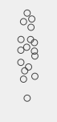
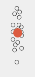

### Dimensionswerte je TeilnehmerIn

   |  
------------- | -------------
Arithmetisches Mittel der Antworten der Einzelfrage der jeweiligen Qualitätsdimension. Aus Gründen der Übersichtlichkeit willkürlicher horizontaler Versatz. |  

### Mittelwert der Dimensionswerte

   |  
------------- | -------------
Arithmetisches Mittel der Dimensionswerte |  

### Quartile

   |  
------------- | -------------
* Quartil: Oberste vertikale Linie  
* Quartil: Oberer Teil der Box  
* Median: Horizontale Linie in Box  
* Quartil: Unterer Teil der Box  
* Quartil Untere vertikale Linie  
Ausreisser (mehr als das 1,5-Fach der Boxhöhe vom Median entfernt) zählen zu keinem Quartil | 

### 95%-Konfidenzintervall
Anmerkung: Überlappen sich zwei Konfidentintervalle nicht, dann ist das ein Hinweis dafür, dass sich die Mittelwerte signifikant unterscheiden.